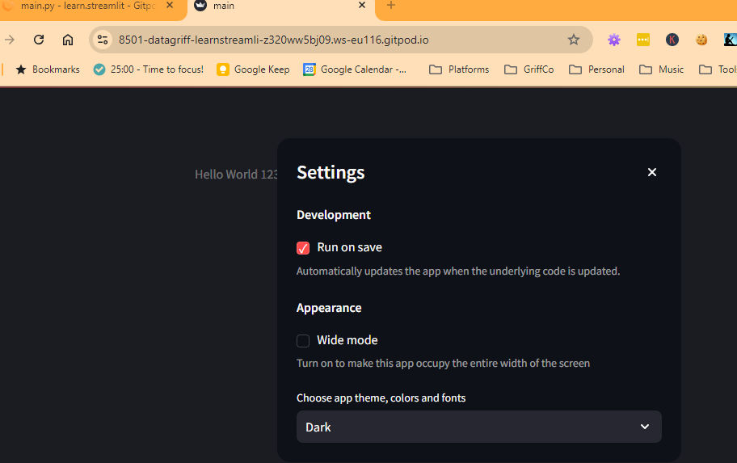

# Streamlit

- [Course](https://www.youtube.com/watch?v=o8p7uQCGD0U)
- [AI Developer](https://offers.hubspot.com/techwithtim-developer-checklist?utm_source=youtube&utm_medium=social&utm_campaign=CR00455Oct2024_TechWithTim%2Fpartner_youtube)

## Fragments

- Using these mean only these components will rerun!
- Big efficiency boost!

```py

## Open API Form Gen??

- [Streamlit Blog](https://blog.streamlit.io/build-a-streamlit-form-generator-app-to-avoid-writing-code-by-hand/)
- [Github](https://github.com/gerardrbentley/streamlit_form_generator?ref=blog.streamlit.io)
- [Demo App](https://gerardrbentley-streamlit-form-generator-streamlit-app-r8b064.streamlit.app/?ref=blog.streamlit.io)

## Pydantic Auto Front Ends

Don't seem to work?

- [Streamlit Pydantic Playground](https://st-pydantic.streamlit.app/)
- [Streamlit Pydantic](https://github.com/lukasmasuch/streamlit-pydantic)
- [Streamlit Pydantic Form](https://github.com/shunichironomura/streamlit-pydantic-form)
- [Well typed form inputs with Streamlit + Pydantic](https://www.reddit.com/r/Python/comments/swt27q/well_typed_form_inputs_with_streamlit_pydantic/?rdt=35458)

```py
pip install -r requirements.txt
```

```py
streamlit run main.py
```

Can set to auto refresh on save



Seems as though streamlit vs code only work in browser but not on my remote vs code 🤷

## Fast API Open API Gen

- [Fast API Code Gen](https://pypi.org/project/fastapi-code-generator/)
- [Medium Fast API Server Gen Open API](https://medium.com/@georgedimitropulos/generate-python-fastapi-server-from-openapi-file-099bfa944d3b)
```

```bash
fastapi-codegen --input ./openapi/creatures.oas.0.0.yaml --output openapi/app
```